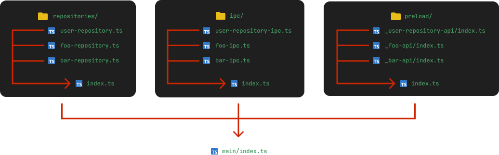

# Electron Fullstack Quick Start Vuetify


Based on [electron-vite-vue](https://github.com/electron-vite/electron-vite-vue)

### Preview


### Build with:

- Typescript
- JS Framework: [Vue 3](https://github.com/vuejs/vue)
- State Management: [Pinia](https://github.com/vuejs/pinia)
- Frontend Tooling: [Vite](https://github.com/vitejs/vite)
- UI Library & Components: [Vuetify 3](https://github.com/vuetifyjs/vuetify)
- Icons: Material Design Icons
- Database: Sqlite3
- Query Builder: [Knex](https://github.com/knex/knex)
- Logging: [Winston](https://github.com/winstonjs/winston)
- DateTime library: [dayjs](https://github.com/iamkun/dayjs)
- Application Builder: [Electron-builder](https://github.com/electron-userland/electron-builder)
- Unit Test: [Vitest](https://github.com/vitest-dev/vitest)

### Features

- Using Vue 3 Composition API
- Using Context Isolation
- Auto Import the `vue` library using [unplugin-auto-import](https://github.com/antfu/unplugin-auto-import), You don't need to add `import` statements for this

## Usage

1. Clone this repo

```bash
git clone https://github.com/aufarijaal/electron-fullstack-quick-start-vuetify
```

2. Go to directory

```bash
cd electron-fullstack-quick-start-vuetify
```

3. Install dependencies and run the development server

```bash
npm i && npm run dev
```

- Run the test

```bash
npm run test / npm run coverage
```

- Test the build

```bash
npm run build
```

## HOW TO?

**How to change icon**: replace icon in `public` folder with same name as `favicon.ico`. size must be at least 256x256.
<br/>
<br/>
**How to change application data directory**: By default, application data placed in `$HOME/(package.json's displayName)`. to change, edit the `appFolderPath` value in `/electron/app-config.ts` to your preference. it will automatically created if not exists.

## OTHER UI OPTIONS

## ARCHITECTURE



- for other `repository`, you can place in `repositories/` folder, then register it in the `repositories/index.ts`
- for other `ipc handlers`, you can place in `ipc/` folder, then register it in the `ipc/index.ts`
- for other `ipc invokers`, you can place in `preload/_ipc_invokers_name` folder, then register it in the `preload/index.ts`

There are some other ui library options for this template. Check below.

- [Electron Fullstack Quick Start (Element Plus)](https://github.com/aufarijaal/electron-fullstack-quick-start)
- [Electron Fullstack Quick Start (Vuestic)](https://github.com/aufarijaal/electron-fullstack-quick-start-vuestic)

## Known bug

1. Cannot call logger in `knexfile.ts`
